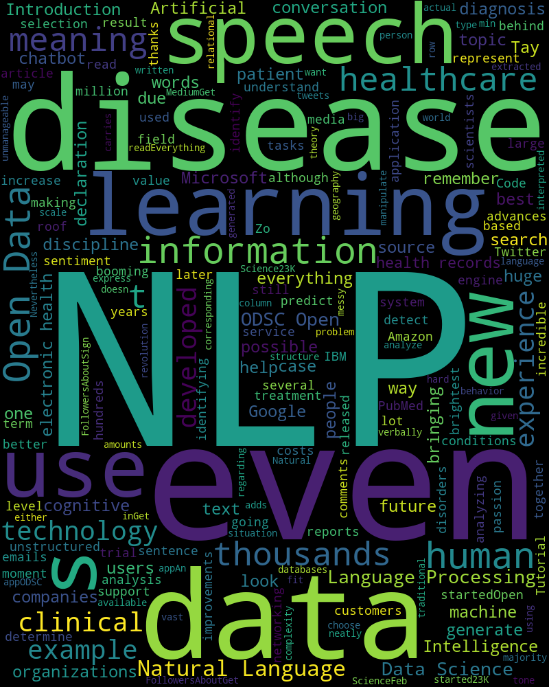

# text-data-processing

### Using Wordcloud library in python, I have written a script which can be able to scrap the text data(paragraphs) from a website and generate the image summary like the above one. We can also feed a text file.
